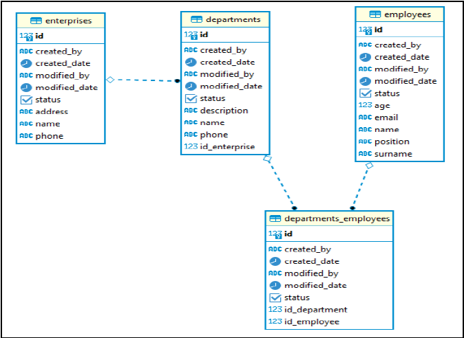

# SICPA_Challenge

This is a solution for a Technical Interview Proposal

## Requirements

I, as a technical interviewer, I request you implement a project that allow me to evaluate your experience in terms of software development, the use of tools and quality control.
The project consists of developing an application or a system that solves the following database model.

### Selected technologies

#### Source Control

- [x] Git

#### Database

- [ ] Oracle
- [x] MariaDB
- [ ] MySQL
- [ ] PostgreSQL

#### Backend

- [ ] Java
  - Springboot
  - JEE
- [x] .NetCore

#### Frontend

- [ ] AngularJS
- [x] Angular
- [ ] Vue.js
- [ ] Android
- [ ] iOS

#### Methodology

- [X] Scrum

### User Stories

#### Companies

As a user, I want to list, create, and edit companies, so that I can manage companies from a user interface.

#### Departments

As a user, I want to list, create, and edit departments, so that I can manage deparments from a user interface.

#### Employees

As a user, I want to list, create, and edit employees, so that I can manage employees from a user interface.

### Special Needs

- [ ] Intallation guide to get the application running.
- [ ] Source code review
- [ ] Share repository
- [ ] Sreenshot of the running application

### Optional

- [ ] Unit test backend.
- [ ] Unit test frontend.
- [ ] Session handling.
- [ ] Role management.

#### Note

There is an acceptance criteria that envolves

     code quality
     code complexity
     handling tools
     use of technologies

## Additional

This project can get running using cloud native principles, so it is necessary to install docker and run

`docker compose run`

With an existing DB I used

`Scaffold-DbContext "Server=localhost;Port=1060;Database=sicpa;User=sicpa_developer;Password=sicpa;" -Provider Pomelo.EntityFrameworkCore.MySql -OutputDir Models/Repositories -ContextDir Models/Contexts -Context SICPAContext -Force -Verbose`

# Improvements and Suggestions
The database model should have an audit table instead of repeating information over each table